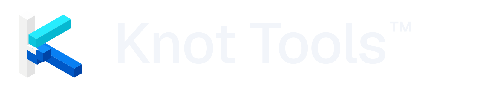

<a href="https://knot.tools">
  <picture>
    <source media="(prefers-color-scheme: dark)" srcset="assets/knot-horizontal-dark.png">
    <source media="(prefers-color-scheme: light)" srcset="assets/knot-horizontal-light.png">
    
  </picture>
</a>

### Automatisation visuelle de workflows pour Dolibarr — et l'écosystème autour.

*[🇬🇧 Read in English](README.md) · 🇫🇷 Français*

---

## 🧰 Ce que nous construisons

Une petite famille de produits qui transforment **Dolibarr** en véritable plateforme d'automatisation. **Knot Tools™** est la marque et l'ombrelle de tout ce qui suit.

<table>
<tr>
<td width="50%" valign="top">

### 🪢 &nbsp; Knot Core
L'éditeur visuel de workflows à l'intérieur de Dolibarr. Canvas drag-and-drop, objets natifs (tiers, factures, propals, projets, stocks, contacts…), exécution via le cron Dolibarr, multi-entité, permissions granulaires, journal d'audit complet.

**Open source sous GPL-3.0.**

</td>
<td width="50%" valign="top">

### 🧩 &nbsp; Knot Pro Pack
Connecteurs premium qui étendent la palette du Core : HTTP sortant, APIs SaaS (Stripe, Google Workspace, Shopify…), nœuds IA dont **Ollama** local, SFTP, Telegram, fan-out d'alertes multi-canal.

Branchés via le manifest d'extension public, **signés et pinnés par version**.

**Extension commerciale** distribuée selon des conditions distinctes — détails sur **[knot.tools](https://knot.tools)** dès que disponibles.

</td>
</tr>
<tr>
<td width="50%" valign="top">

### 🚚 &nbsp; Knot Migration
Assistant de migration pour les instances Dolibarr venant d'anciennes versions ou d'autres ERP. Mapping de schéma, dry-run avec diff, transferts idempotents, journal d'audit.

Actuellement utilisé en interne pour l'onboarding des nouveaux bêta-testeurs. **Extension commerciale** dont la distribution autonome est prévue ultérieurement — détails sur **[knot.tools](https://knot.tools)** dès que disponibles.

</td>
<td width="50%" valign="top">

### 🌐 &nbsp; knot.tools
Le site produit — inscription bêta, actualités, pointeurs vers la documentation au fur et à mesure de son ouverture.

Sobre, sans tracker, sans cookie. Contact : **`contact@knot.tools`** *(réponse humaine, pas d'autorépondeur)*.

</td>
</tr>
</table>

---

## ✨ Ce qui le distingue

<table>
<tr>
<td width="33%" align="center" valign="top">

### 🎨
**Éditeur visuel**

Canvas Vue Flow, mode sombre, palette **Cmd+K**, undo / redo, UX clavier-first, inspecteur multi-onglets avec validation TypeScript live.

</td>
<td width="33%" align="center" valign="top">

### 🪢
**Natif Dolibarr**

Triggers sur les objets natifs **Dolibarr V20+** : tiers, factures, propals, projets, stocks, contacts, tickets, agenda, membres…

</td>
<td width="33%" align="center" valign="top">

### 🔒
**100 % self-hosted**

Credentials AES-256-GCM au repos, HTTP durci anti-**SSRF** avec mitigation **DNS-rebinding**, aucun cloud obligatoire, aucune télémétrie, aucun phone-home.

</td>
</tr>
<tr>
<td width="33%" align="center" valign="top">

### 🌍
**Multi-entité**

Isolation stricte par entité Dolibarr. **Permissions granulaires** appliquées pour chaque capacité Knot, partout.

</td>
<td width="33%" align="center" valign="top">

### 🧬
**Résilient par conception**

Politiques de retry par nœud, backoff exponentiel, routes d'erreur, clés d'idempotence, rate-limiting webhook/OAuth, traces d'exécution structurées.

</td>
<td width="33%" align="center" valign="top">

### 🌐
**International, jour 1**

Strings intégrées en **FR · EN · ES · IT · PT · DE**. Chaque chaîne utilisateur passe par la couche de traduction Dolibarr — aucun texte UI en dur.

</td>
</tr>
</table>

---

## 🔬 Fiabilité & qualité

Nous traitons la fiabilité comme une fonctionnalité, pas une réflexion après coup.

<table>
<tr>
<td width="50%" valign="top">

### 🧪 &nbsp; Suites de tests
**PHPUnit** — 605 tests · 2 013 assertions, avec une couverture cible de **80 %** sur le moteur et la couche repository. 
**Vitest** — tests unitaires et de composants frontend sur chaque commit. 
**Playwright** — scénarios end-to-end de l'éditeur sur de vraies instances Dolibarr.

</td>
<td width="50%" valign="top">

### 🔁 &nbsp; Matrice CI
La suite backend tourne sur **Dolibarr 20.0 · 21.0 · 22.0** combinés avec **PHP 8.1 · 8.2 · 8.3** (neuf combinaisons) sur chaque push et pull request, plus un job build frontend + Vitest et une vérification de style PSR-12 stricte.

</td>
</tr>
<tr>
<td width="50%" valign="top">

### 🛡️ &nbsp; Durci par conception
Le HTTP sortant passe par `Knot\Security\UrlPolicy` : chaque URL est validée, les **plages IP privées et de cloud-metadata sont bloquées**, et l'adresse résolue est épinglée à travers cURL pour empêcher les attaques **DNS-rebinding**. 
Les **advisories de dépendances** sont surveillées en continu (PHP et frontend) pour qu'une bibliothèque amont vulnérable soit détectée avant d'atteindre la prod.

</td>
<td width="50%" valign="top">

### 🔐 &nbsp; Cryptographie & audit
Credentials chiffrés au repos en **AES-256-GCM**, jamais loggés, jamais exportés. 
Chaque action sensible est loggée dans le journal immutable `llx_knot_audit_log` avec recherche full-text serveur et export CSV. 
Les manifestes de release du Pro Pack sont **signés Ed25519** et épinglés par le vérifieur du Core.

</td>
</tr>
</table>

---

## 📦 Statut

🚀 &nbsp; **Knot est en bêta privée.** Le code source vit dans des dépôts privés pendant la bêta. **Knot Core** est destiné à une publication open source sous **GPL-3.0** une fois la chaîne de licence scellée (prévu avant le lancement public du Pro Pack). Les notes de version publiques et l'onboarding des testeurs sont publiés sur **[knot.tools](https://knot.tools)**.

📜 &nbsp; **Knot Tools™** est une marque en cours de dépôt. Le module produit est référencé simplement comme **Knot** dans les contextes techniques et **Knot Core** dans les contextes de distribution ; la marque ombrelle est **Knot Tools**.

---

## 🧭 Nous trouver

| | |
|---|---|
| 🌐 &nbsp; Site produit & inscription bêta | **<https://knot.tools>** |
| 📬 &nbsp; Contact général | `contact@knot.tools` |
| 🔐 &nbsp; Signalement de vulnérabilité | `security@knot.tools` · [politique de sécurité](../SECURITY.fr.md) · [`security.txt`](https://knot.tools/.well-known/security.txt) |
| 🤝 &nbsp; Code de conduite | [Contributor Covenant 2.1](../CODE_OF_CONDUCT.fr.md) |
| 🛟 &nbsp; Support | [SUPPORT.fr.md](../SUPPORT.fr.md) |
| ✍️ &nbsp; Contribuer | [CONTRIBUTING.fr.md](../CONTRIBUTING.fr.md) |

---

## 🏷️ Marque

**Knot Tools™** est une marque en cours de dépôt. Vous pouvez référencer le projet dans un cadre éditorial, technique ou comparatif. Vous ne pouvez pas utiliser la marque d'une manière qui suggère une recommandation, un partenariat ou une origine Knot Tools sans autorisation écrite. Le logo Knot et les éléments graphiques proviennent du brand pack officiel distribué avec **Knot Core**.

## 📄 Licence

**Knot Core** est publié sous **GPL-3.0-or-later**. Les autres composants de l'écosystème **Knot Tools** peuvent être distribués sous d'autres termes — consultez le dépôt correspondant lors de sa publication.

---

*Knot Tools™ — automatisation visuelle de workflows pour Dolibarr.* 
*Conçu avec soin, hébergé nulle part par défaut.*

Made with ❤️ &amp; Grind.

